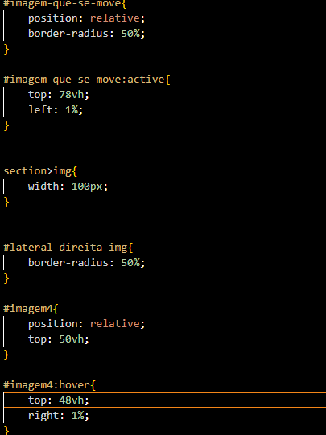
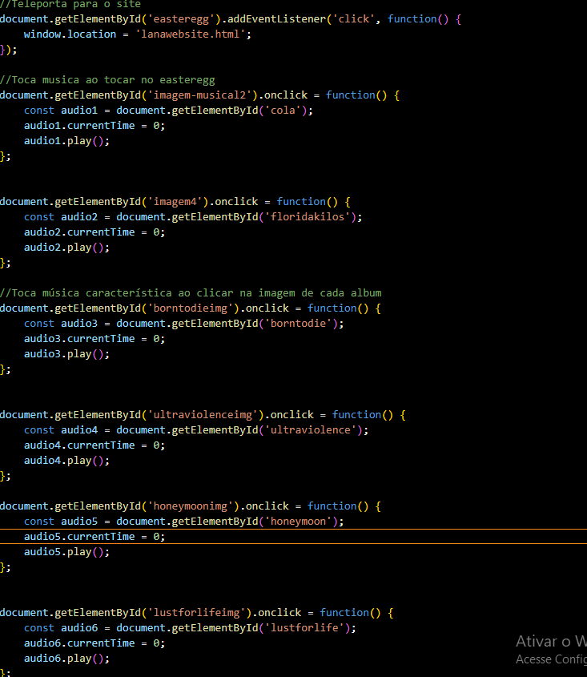
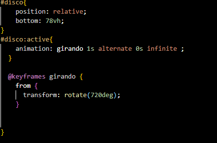

# TÓPICO DO SITE
- Lana Del Rey

# NOME DO SITE
- Lana da Web

# URL DO SITE

https://caiofillipe.github.io/TrabalhoPratico-Caio/

# Itens Opcionais Feitos

<h1>FLEXBOX E GRID</h1>

<h1>IFRAME<h1>

<h1>POSICIONAMENTO NÃO ESTÁTICO<h1>

<h1> INTERAÇÃO COM JAVA SCRIPT / EASTER EGG<h2>

<h1>ANIMACAO<h1>

<h1> EASTEREGG <h1>
